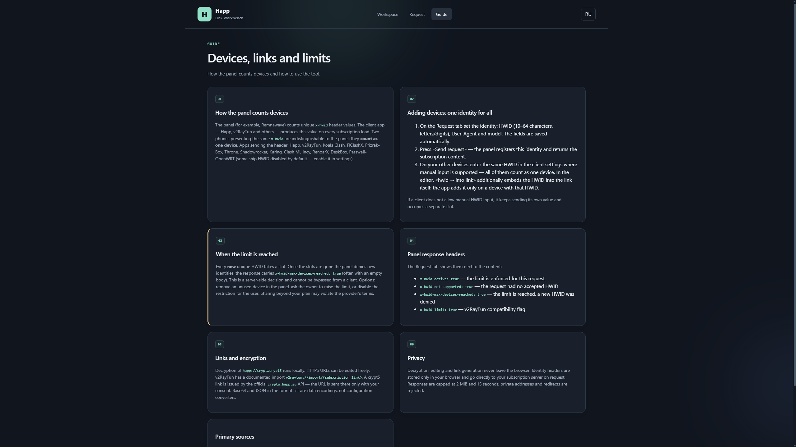
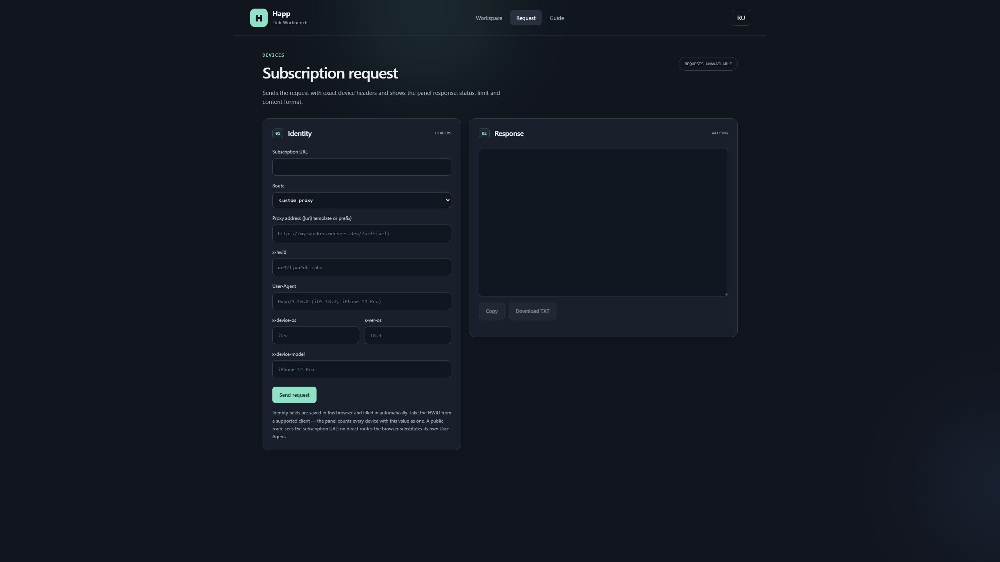

# Happ Link Decryptor

[Live preview](https://cylaro.github.io/happ-decryptor/) · [Report an issue](https://github.com/cylaro/happ-decryptor/issues)

Браузерный рабочий стол для `happ://` deep-link-ссылок: расшифровка зашифрованных ссылок подписки, редактирование URL назначения, повторное шифрование через официальный Happ API и конвертация между форматами импорта клиентов. Все криптографические операции выполняются локально в браузере.

Поддерживаемые форматы ссылок: `crypt`, `crypt2`, `crypt3`, `crypt4`, `crypt5` (обычный и солёный layout).

## Скриншоты

| Рабочая область | Запрос | Инструкция |
|---|---|---|
|  |  |  |

## Возможности

- **Расшифровка** — поколения 1–4 это RSA-PKCS1v15-обёртки, расшифровываемые через [node-forge](https://github.com/digitalbazaar/forge); `crypt5` использует восстановление ключа RSA-4096 плюс ChaCha20-Poly1305 через [noble-ciphers](https://github.com/paulmillr/noble-ciphers). Нативный CPU-эмулятор ([unicorn.js](https://github.com/AlexAltea/unicorn.js)) остаётся автоматическим фоллбэком. 36 встроенных ключей `crypt5`.
- **Редактор ссылок** — редактируйте URL назначения и его query-параметры (повторяющиеся параметры сохраняются), привяжите HWID к ссылке, генерируйте все поддерживаемые форматы вывода: чистый URL, текст Base64, JSON, `v2raytun://import`, `clash://install-config`, `sing-box://import`, плюс QR-коды.
- **Идентичность устройства** — отправляйте запросы подписки с набором заголовков Happ (`x-hwid`, `x-device-os`, `x-ver-os`, `x-device-model`, `User-Agent`) и изучайте ответ панели, включая `x-hwid-max-devices-reached` и связанные заголовки. Запросы идут через локальный мост (Vite middleware) или публичный прокси-маршрут.
- **Официальное шифрование** — оберните любой URL в ссылку `happ://crypt5` через официальный [crypto.happ.su](https://crypto.happ.su) API, с явным согласием.
- **Английский / русский интерфейс**, выбор сохраняется между визитами.

## Разработка

```bash
npm install
npm run dev        # локальный сервер с мостом запросов
npm test           # юнит-тесты (node --test)
npm run test:browser  # браузерные тесты (Playwright, headless)
npm run build      # production-сборка в dist/
npm run preview    # production-сборка с мостом
```

Мост запросов — это Vite middleware (`server/bridge.js`), монтируемый в `configureServer` и `configurePreviewServer`. Он пересылает заголовки устройства целевому серверу и соблюдает ограничения: только loopback, DNS pinning, отказ от редиректов, лимиты размера и времени запроса/ответа.

## Тестирование

- 59 юнит-тестов покрывают round-trip шифрования crypt5/legacy, разбор и редактирование ссылок, конвертеры и контракт HWID-заголовков.
- 10 Playwright браузерных тестов покрывают рабочий процесс редактора, обработку ошибок, переключение языков, сохранение идентичности и мобильную вёрстку.

## Поддержать / Donate

Если проект был полезен — можно поддержать разработку, **USDT в сети TON**:

```text
UQCcN9hahBxM5q3GGwx79UNEu82EF0kFTwnRRklL_1OLtK15
```

Кошельки Tonkeeper, @wallet и любые TON-кошельки принимают тот же адрес (`ton://transfer/UQCcN9hahBxM5q3GGwx79UNEu82EF0kFTwnRRklL_1OLtK15`).

## Дисклеймер

Образовательный проект: демонстрирует, как устроено шифрование `happ://`-ссылок и подсчёт устройств по HWID. Вы отвечаете за соблюдение условий вашего провайдера и применимого законодательства. Не связан с Happ или Remnawave. Без гарантий (см. [LICENSE](LICENSE)).

## Credits

Основан на [LeeeeT/happ-decryptor](https://github.com/LeeeeT/happ-decryptor). Исходный репозиторий опубликован без лицензии; этот проект сохраняет видимую атрибуцию.

## Связанные проекты

- **[happ-relay-cloudflare](https://github.com/cylaro/happ-relay-cloudflare)** — сопутствующий проект: самостоятельно размещаемый Cloudflare Worker, позволяющий неограниченному числу устройств делить одну HWID-идентичность на панелях с лимитами.
- **[happ-relay-cloudflare-vercel](https://github.com/cylaro/happ-relay-cloudflare-vercel)** — тот же релей «много устройств — один HWID» на Vercel, для сетей, где Cloudflare неудобен.
